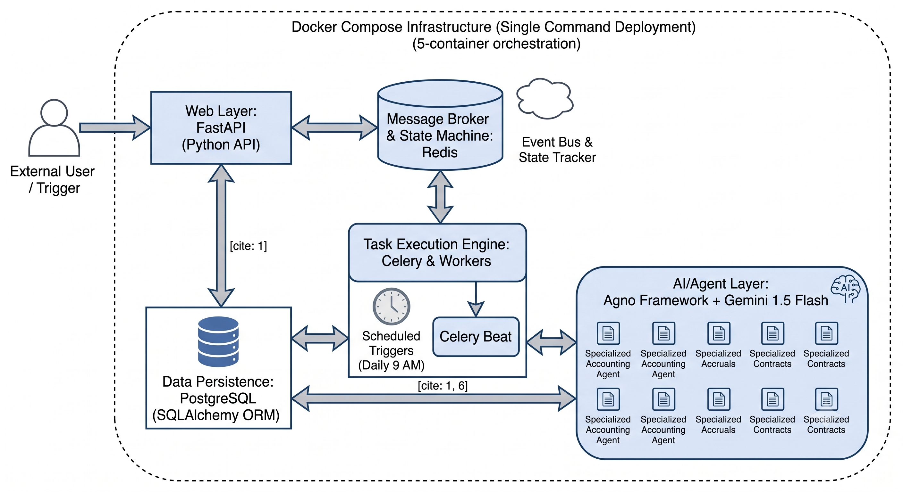
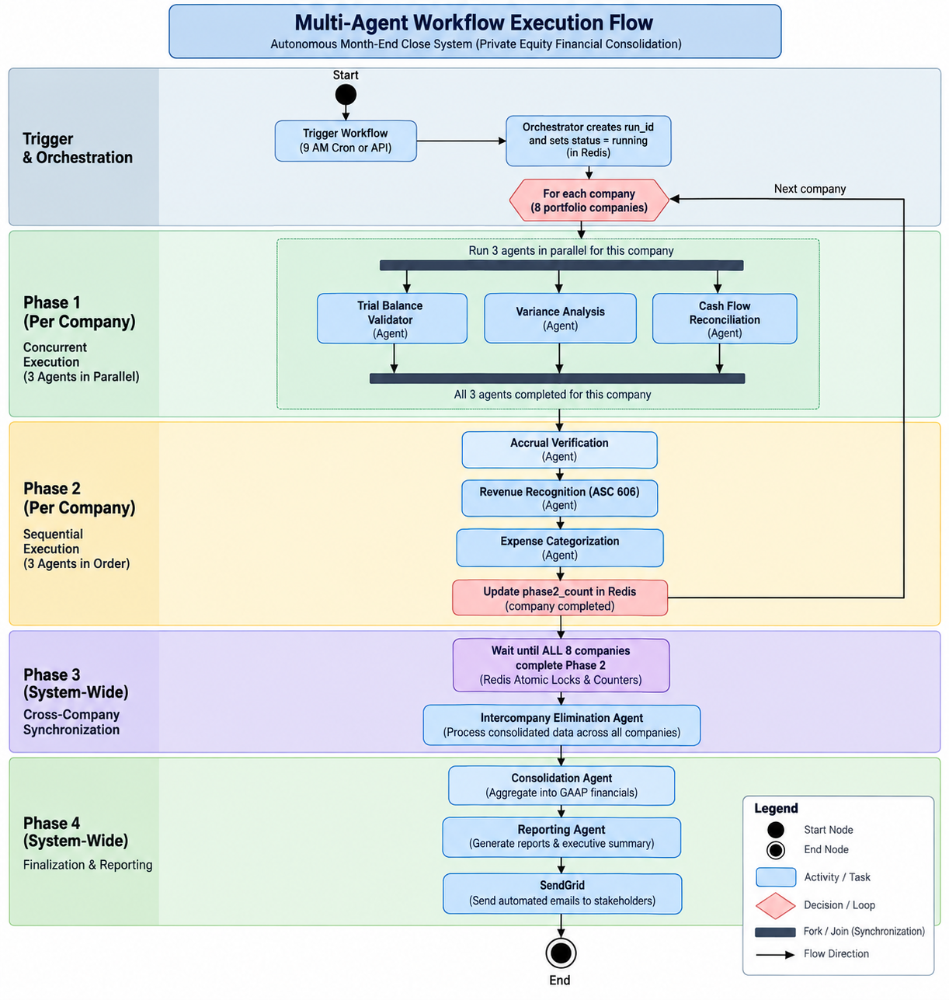
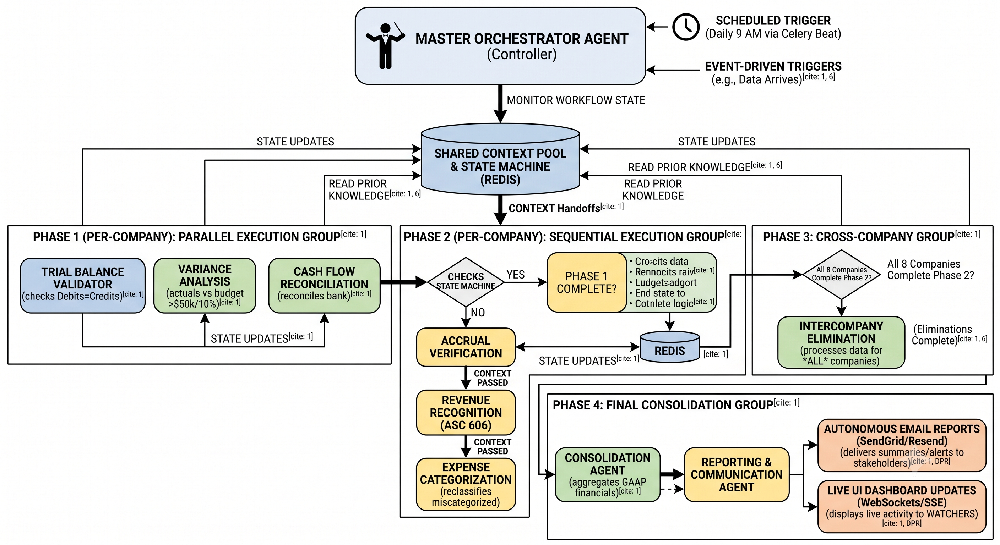
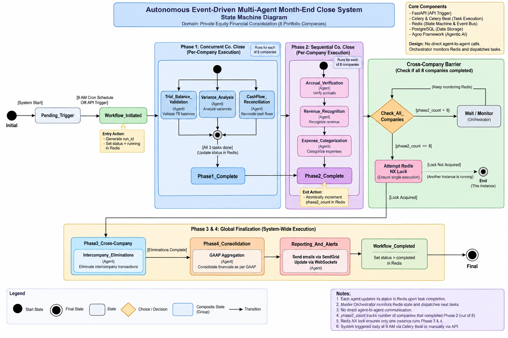
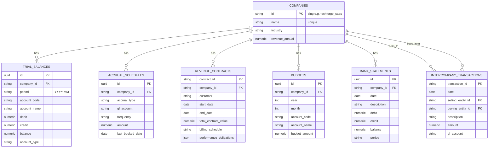

# 📄 Final `README.md` — Complete, Copy-Paste Ready

```markdown
# Synapse Portfolio — Autonomous Month-End Close

A multi-agent AI platform that orchestrates the month-end close for a PE fund's portfolio of 8 companies. Built with **Agno**, **Gemini**, **Celery**, **FastAPI**, and **Streamlit**.

---

## 🎥 Video Demo

[**Watch the 7-minute walkthrough →**](https://youtu.be/YOUR_VIDEO_ID)

*Covers: autonomous operation, live agent activity, entity drill-down, email generation, and the NLQ CFO assistant.*

---

## 📋 Table of Contents

- [Quick Start](#-quick-start-5-minutes)
- [Architecture](#-architecture)
- [The 10 Agents](#-the-10-agents)
- [Key Design Decisions](#-key-design-decisions)
- [Autonomous Operation](#-autonomous-operation)
- [Financial Correctness](#-financial-correctness)
- [Known Limitations](#️-known-limitations)
- [Configuration](#️-configuration)
- [Agent Workflow Diagrams](#-agent-workflow-diagrams)
- [Database Schema](#-database-schema)
- [API Reference](#-api-reference)
- [Tech Stack](#-tech-stack)
- [Project Structure](#-project-structure)
- [Written Summary](#-written-summary)

---

## 🚀 Quick Start (< 5 minutes)

```bash
# 1. Clone and configure
git clone <your-repo-url> synapse-portfolio
cd synapse-portfolio
cp .env.example .env

# 2. Add your Gemini API key (free at https://aistudio.google.com/app/apikey)
#    Edit .env → set GEMINI_API_KEY=<your-key>

# 3. Start the full stack
docker compose up -d --build
sleep 15

# 4. Seed the database (one-time)
docker compose exec api python -m app.data_ingestion.seed

# 5. Trigger a close (or wait for Celery Beat at 9 AM if autonomous mode enabled)
docker compose exec api python -c "import requests; requests.post('http://api:8000/api/v1/trigger-close')"
```

### Access

| Service | URL |
|---------|-----|
| 📊 Dashboard | http://localhost:8501 |
| 📖 API Docs (Swagger) | http://localhost:8000/docs |
| ❤️ Health Check | http://localhost:8000/health |

---

## 🏗 Architecture



**Infrastructure:** Docker Compose with 6 services — `postgres`, `redis`, `worker` (Celery, 4-way concurrency), `beat`, `api` (FastAPI), `ui` (Streamlit).

### Execution Flow

The pipeline runs 5 phases through a Celery task graph. Phases 1–2 run per company; Phases 3–4 are system-wide.



### Agentic System Design

Each of the 10 agents uses the ReAct pattern: deterministic tool call → observation → LLM reasoning → next action. Redis provides shared state for handoffs and event-based triggering.



### Workflow State Machine

State transitions are coordinated via Redis atomic operations (`SET NX` lock for Phase 3, `INCR` counter for Phase 2 completion tracking).



---

## 🤖 The 10 Agents

| # | Agent | Module | Role |
|---|-------|--------|------|
| 1 | **Orchestrator** | `app/agents/orchestrator.py`<br>`orchestrator_agent.py` | Coordinates the 5-phase Celery pipeline. Pre-flight decides whether to run; post-flight decides escalation. |
| 2 | **Trial Balance Validator** | `app/agents/validator.py` | Validates debits=credits, sign sanity, duplicate detection. |
| 3 | **Variance Analysis** | `app/agents/variance.py` | Actual vs budget, flags >$50K or >10% variances, drills into history to distinguish trends from spikes. |
| 4 | **Accrual Verification** | `app/agents/accrual_verification.py` | Flags stale, zero, orphan, and duplicate accruals by cadence pattern. |
| 5 | **Intercompany Elimination** | `app/agents/elimination.py` | Reconciles IC transactions across entities; computes matched flow + asymmetries; generates elimination amounts. |
| 6 | **Revenue Recognition** | `app/agents/revenue_recognition.py` | ASC 606 audit. **Day-based proration** for mid-month contract starts. |
| 7 | **Expense Categorization** | `app/agents/expense_categorization.py` | Detects miscategorization. **Constrained to company's Master CoA** — never invents codes. |
| 8 | **Cash Flow Reconciliation** | `app/agents/cash_flow.py` | GL cash movement vs bank statement movement; investigates gaps. |
| 9 | **Consolidation** | `app/agents/consolidation.py` | Group P&L with **GAAP intercompany netting** + conservative asymmetry haircut. |
| 10 | **Reporting** | `app/agents/reporting.py`<br>`reporting_agent.py` | Decides which emails to send (completion / daily / weekly / issue alert) and dispatches them via Resend. |

> **🎁 Bonus #2 — Natural Language Query** (`app/agents/nlq.py`): CFO can ask *"Why is R&D over budget at TechForge?"* and get an answer grounded in the same deterministic tools the pipeline uses.

---

## 💡 Key Design Decisions

### 1. Hybrid: Python calculates, LLM reasons

Every dollar is computed in deterministic Python (`Decimal`, no floats) and stored via SQLAlchemy. Gemini's role is **narrative synthesis, prioritization, and NLQ** — not arithmetic.

**Why:** A hallucinated 5% error in EBITDA is unacceptable for a PE close. Auditability requires exact, reproducible numbers. LLMs are fluent but not numerically reliable.

**What this means:**

- ✅ All P&L, EBITDA, IC elimination figures — Python-computed, `Decimal`-exact
- ✅ Narrative summaries, variance commentary, prioritization — LLM-generated
- ✅ Fallback: if the LLM fails, agents return deterministic results with a fixed narrative. **Numbers never change.**

### 2. Deterministic-first with a ReAct escalation path

Each agent runs a deterministic pre-check first. If the data is clean, the agent returns a PASSED result **without invoking the LLM** — saving quota for companies that actually need investigation. Only when issues are found does the ReAct reasoning loop fire.

### 3. Redis-backed rate limiter

The system enforces `GEMINI_MAX_RPM=12` requests per minute **across all Celery workers**, via a shared Redis counter. Each `agent.run()` reserves 4 slots upfront (accounting for internal ReAct loops). This keeps the real HTTP rate well under Gemini's free-tier ceiling of 15 RPM.

### 4. Three guardrails for traps in the assignment

| Trap | Requirement | Our Solution |
|------|-------------|--------------|
| **Trap 1** — Mid-month revenue | Day-based proration | `revenue_recognition.py` uses `overlap_days / total_contract_days` — exact-day proration. A $120K annual contract starting Jan 17 recognizes **~$4,931** in January, not $10,000. |
| **Trap 2** — IC mismatch | Don't force-book; flag for review | Matched flow is netted from group revenue and expense. Unmatched asymmetry is booked as a **conservative EBITDA haircut** and flagged for human review. |
| **Trap 3** — CoA hallucination | Never invent codes | Expense agent's `suggest_reclassification()` returns codes **only** from the company's existing Master CoA. If nothing fits, returns `valid=False` and defers to human review. |

---

## ⏰ Autonomous Operation

Celery Beat schedules are configured in `app/core/celery_app.py`. Default mode is **manual trigger only** (for testing/demos); set `ENABLE_AUTONOMOUS_SCHEDULE=1` to activate the daily + month-end close cadence.

| Task | Schedule | Active by default |
|------|----------|-------------------|
| Daily summary email | 8:00 AM UTC daily | ✅ Always |
| Weekly stakeholder report | Monday 8:00 AM UTC | ✅ Always |
| Issue alert sweep | 12:00 PM UTC daily | ✅ Always |
| Full close (continuous) | 9:00 AM UTC daily | Only if `ENABLE_AUTONOMOUS_SCHEDULE=1` |
| Formal month-end close | 1st of month, 9:30 AM UTC | Only if `ENABLE_AUTONOMOUS_SCHEDULE=1` |

**Manual trigger:** `POST /api/v1/trigger-close` (used by the demo).

### Self-Healing

- **Celery task retries:** Every task declares `autoretry_for=(Exception,)` with exponential backoff + jitter, 3 attempts.
- **Agent-level retries:** Each agent has its own retry loop for transient LLM errors (`429`, `503`, timeouts).
- **Escalation:** Persistent failures set a Redis key `close:{run_id}:escalation` for human review.
- **Distributed lock:** Phase 3 fires exactly once via Redis `SET NX`.

---

## 💰 Financial Correctness

| Area | Rule |
|------|------|
| **Trial Balance** | `SUM(debit) == SUM(credit)` within $1; sign-sanity per account type; contra-normal accounts (Allowance, Accumulated) exempted |
| **Revenue** | ASC 606 day-based proration per obligation; stale milestone detection on ended contracts |
| **Intercompany** | Matched IC flow (min of both directions) netted from group revenue **AND** group expense — true GAAP elimination, not just an EBITDA adjustment |
| **Consolidation** | Revenue / COGS / OpEx bucketing; asymmetry haircut applied for unmatched IC |
| **Expense Reclassification** | Constrained to Master CoA; taxonomy cannot be invented |

---

## ⚠️ Known Limitations

### Gemini free-tier 503s

The free tier occasionally returns `503 UNAVAILABLE` when Google's servers are overloaded. This is a **server-side error, not a rate limit breach** — no `429` errors have been observed.

**What happens:**

1. Agent's retry logic fires (3 attempts with jittered backoff)
2. If all attempts fail, deterministic fallback preserves all numbers and produces a fixed narrative

**Production fix:** Upgrade to a paid Gemini tier (~$5/month for this workload) OR configure a multi-provider fallback (Claude / OpenAI) — the architecture is provider-agnostic.

### Not Implemented

- Balance Sheet and Cash Flow statement in consolidation (only P&L today)
- Bonus #1: Predictive Close Timeline
- Bonus #3: Auto-Generated Journal Entries
- Bonus #4: Audit Trail Export
- ✅ Bonus #2: Natural Language Query — **implemented**

### UI

Polling-based (Streamlit `autorefresh`). No WebSocket/SSE — acceptable per the assignment spec ("polling — your call").

---

## ⚙️ Configuration

All environment variables are validated on startup via `pydantic-settings`. See `.env.example`.

| Variable | Required | Default | Purpose |
|----------|:--------:|---------|---------|
| `GEMINI_API_KEY` | ✅ | — | Google AI Studio key |
| `RESEND_API_KEY` | ❌ | — | Email delivery. Empty = mock mode (logs HTML) |
| `TO_EMAIL` / `FROM_EMAIL` | ❌ | example values | Email recipients |
| `POSTGRES_*` / `DATABASE_URL` | ✅ | sensible defaults | Database |
| `REDIS_URL` / `CELERY_*` | ✅ | sensible defaults | Broker + state |
| `CLOSE_COMPANIES` | ❌ | empty (= all 8) | Comma-separated subset for demos |
| `ENABLE_AUTONOMOUS_SCHEDULE` | ❌ | `0` | `1` = enable Beat-triggered closes |
| `GEMINI_MAX_RPM` | ❌ | `12` | Fleet-wide rate cap |
| `AGENT_DEBUG` | ❌ | `0` | `1` = verbose Agno traces |

---

## 🔄 Agent Workflow Diagrams

The diagrams below show how the 10 agents coordinate across the 5-phase pipeline.

### Per-Company Phases (1 & 2)

**Phase 1 — Parallel** via Celery `chord`: three agents (TB Validator, Variance, Cash Flow) run concurrently per company. The chord callback fires Phase 2 only when all three complete.

**Phase 2 — Sequential** via Celery `chain`: Accrual Verification → Revenue Recognition → Expense Categorization run in order. Expense categorization depends on revenue classification, which depends on accruals being reconciled.

### Cross-Company Phases (3 & 4)

**Phase 3 — Intercompany Elimination** fires exactly once per run (Redis `SET NX` lock), after all companies complete Phase 2. It reconciles IC transactions and computes matched flow + asymmetries.

**Phase 4 — Consolidation** nets matched IC from group revenue and expense, applies the asymmetry haircut, and produces adjusted group EBITDA.

### Orchestrator Decision Layer

- **Pre-Flight** (Agno agent): decides whether to proceed. Checks portfolio state and current run status.
- **Post-Flight** (Agno agent): reviews completed run and decides if human escalation is needed.

See `docs/diagrams/02-workflow-flow.png` for the full phase-by-phase flow diagram.

---
### Entity-Relationship Diagram


## 🗄 Database Schema

PostgreSQL with 7 tables. All financial amounts use `Numeric(18, 2)` (exact decimals, never floats).

### `companies`
| Column | Type | Notes |
|--------|------|-------|
| `id` | `String(64)` PK | Slug, e.g. `techforge_saas` |
| `name` | `String(255)` UNIQUE | Human-readable |
| `industry` | `String(120)` | e.g. SaaS, Manufacturing |
| `revenue_annual` | `Numeric(18,2)` | Annual revenue |

### `trial_balances`
| Column | Type | Notes |
|--------|------|-------|
| `id` | `UUID` PK | |
| `company_id` | `FK companies.id` | CASCADE delete |
| `period` | `String(7)` | `YYYY-MM` |
| `account_code` | `String(32)` | 4-digit GL code |
| `account_name` | `String(255)` | |
| `debit`, `credit`, `balance` | `Numeric(18,2)` | |
| `account_type` | `String(32)` | Asset, Liability, Revenue, COGS, Expense, … |

**Unique:** `(company_id, period, account_code)`
**Index:** `(company_id, period)`

### `intercompany_transactions`
| Column | Type | Notes |
|--------|------|-------|
| `transaction_id` | `String(64)` PK | |
| `date` | `Date` | |
| `selling_entity_id`, `buying_entity_id` | `FK companies.id` | RESTRICT |
| `description` | `String(500)` | |
| `amount` | `Numeric(18,2)` | |
| `gl_account` | `String(32)` | |

**Index:** `(selling_entity_id, buying_entity_id, date)`

### `accrual_schedules`
| Column | Type | Notes |
|--------|------|-------|
| `id` | `UUID` PK | |
| `company_id` | `FK companies.id` | |
| `accrual_type` | `String(255)` | |
| `gl_account` | `String(32)` | |
| `frequency` | `String(32)` | monthly / quarterly / annual / weekly |
| `amount` | `Numeric(18,2)` | |
| `last_booked_date` | `Date` | |

**Index:** `(company_id, accrual_type)`

### `revenue_contracts`
| Column | Type | Notes |
|--------|------|-------|
| `contract_id` | `String(64)` PK | |
| `company_id` | `FK companies.id` | |
| `customer` | `String(255)` | |
| `start_date`, `end_date` | `Date` | Service period |
| `total_contract_value` | `Numeric(18,2)` | |
| `billing_schedule` | `String(64)` | |
| `performance_obligations` | `JSON` | Array of `{description, value, revenue_recognition, completion_percentage?}` |

**Index:** `(company_id)`

### `budgets`
| Column | Type | Notes |
|--------|------|-------|
| `id` | `UUID` PK | |
| `company_id` | `FK companies.id` | |
| `year`, `month` | `Integer` | |
| `account_code` | `String(32)` | |
| `account_name` | `String(255)` | |
| `budget_amount` | `Numeric(18,2)` | |

**Unique:** `(company_id, year, month, account_code)`
**Index:** `(company_id, year, month)`

### `bank_statements`
| Column                        | Type              | Notes     |
|-------------------------------|-------------------|-----------|
| `id`                          | `UUID` PK         |           |
| `company_id`                  | `FK companies.id` |           |
| `date`                        | `Date`            |           |
| `description`                 | `String(500)`     |           |
| `debit`, `credit`, `balance`  | `Numeric(18,2)`   |           |
| `period`                      | `String(7)`       | `YYYY-MM` |

**Index:** `(company_id, period)`

### Why separate bank statements?

Reconciliation is literally the act of comparing two independent ledgers (GL vs. bank). Merging them would hide the discrepancy the Cash Flow agent exists to find.

---

## 📡 API Reference

Base URL: `http://localhost:8000`

### `GET /health`

Liveness check — verifies Postgres + Redis connectivity.

**Response:**
```json
{
  "status": "healthy",
  "postgres": true,
  "redis": true
}
```

### `POST /api/v1/trigger-close`

Trigger a full month-end close pipeline. Idempotent — each call generates a unique `run_id`.

**Request:**
```
POST /api/v1/trigger-close
(no body required)
```

**Response:**
```json
{
  "run_id": "c5e9ae7a-0d26-418d-9b17-34cf1d01368b",
  "status": "queued"
}
```

**Behavior:**

1. Generates a UUID `run_id`
2. Enqueues `orchestrator.run_month_end_close` on the Celery broker
3. Sets `close:latest_run_id` in Redis (24h TTL) so the UI auto-discovers it
4. Returns immediately — the pipeline runs asynchronously

**Errors:**
- `500` — Redis or Celery broker unreachable

### State Inspection (via Redis)

The pipeline publishes its full state to Redis. Query directly for programmatic access:

| Key                                           | Type          | Purpose                                       |
|-----------------------------------------------|---------------|-----------------------------------------------|
| `close:latest_run_id`                         | String        | Most recent run ID (24h TTL)                  |
| `close:runs:recent`                           | List          | Last 50 run IDs                               |
| `close:{run_id}:status`                       | String        | `running` / `completed` / `failed` / `skipped`|
| `close:{run_id}:companies`                    | JSON Array    | Companies included in this run                |
| `close:{run_id}:total_companies`              | Integer       | Target entity count                           |
| `close:{run_id}:preflight`                    | JSON          | Pre-flight decision                           |
| `close:{run_id}:phase1:{company_id}`          | String        | `done` when Phase-1 chord completes           |
| `close:{run_id}:phase1_failures:{company_id}` | CSV String    | Failed agent names                            |
| `close:{run_id}:phase2_count`                 | Integer       | Companies that finished Phase 2               |
| `close:{run_id}:phase3:result`                | JSON          | Intercompany elimination result               |
| `close:{run_id}:final_result`                 | JSON          | Consolidated financials + summary             |
| `close:{run_id}:postflight`                   | JSON          | Post-flight escalation decision               |
| `close:{run_id}:escalation`                   | String        | Reason a run needs human review               |

### OpenAPI / Swagger

Interactive docs auto-generated by FastAPI:

- Swagger UI: `http://localhost:8000/docs`
- ReDoc: `http://localhost:8000/redoc`
- OpenAPI JSON: `http://localhost:8000/openapi.json`

---

## 🛠 Tech Stack

| Layer                 | Technology                                                            |
|-----------------------|-----------------------------------------------------------------------|
| Multi-agent framework | **Agno 3.x** — ReAct loop, Pydantic output schemas                    |
| LLM                   | **Gemini 3.1 Flash Lite** (swappable for Claude / OpenAI)             |
| API                   | **FastAPI + Pydantic** — structured validation                        |
| Database              | **PostgreSQL + SQLAlchemy** — Decimal columns, unique constraints     |
| State & Cache         | **Redis** — workflow state, rate limiter, run tracking                |
| Task Queue            | **Celery + Beat** — task graph, scheduled jobs, exponential backoff   |
| UI                    | **Streamlit** — live dashboard + NLQ chat                             |
| Email                 | **Resend** — mock mode if no API key                                  |
| Deployment            | **Docker Compose** — 6-service stack                                  |

---

## 📁 Project Structure

```
app/
├── agents/                    # 10 agents
│   ├── validator.py           # Trial Balance
│   ├── variance.py            # Variance Analysis
│   ├── cash_flow.py           # Cash Flow Reconciliation
│   ├── accrual_verification.py
│   ├── revenue_recognition.py
│   ├── expense_categorization.py
│   ├── elimination.py         # Intercompany
│   ├── consolidation.py
│   ├── reporting.py           # Executor (Jinja2 + Resend)
│   ├── reporting_agent.py     # Decision layer
│   ├── orchestrator.py        # Celery 5-phase task graph
│   ├── orchestrator_agent.py  # Pre-flight + Post-flight
│   └── nlq.py                 # CFO Assistant (bonus)
├── core/
│   ├── celery_app.py          # Celery + Beat config
│   └── rate_limit.py          # Redis-backed Gemini limiter
├── data_ingestion/
│   └── seed.py                # Loads assignment1_data/
├── db/
│   ├── database.py            # SQLAlchemy session + settings
│   └── models.py              # Company, TB, IC, Accruals, Contracts, Budgets, Bank
├── ui/
│   └── dashboard.py           # Streamlit monitor + chat
└── main.py                    # FastAPI entrypoint

assignment1_data/              # Provided dataset (8 companies)
docs/
└── diagrams/                  # Architecture + workflow diagrams
scripts/
├── e2e_test.py                # End-to-end trigger + polling
├── trigger.py                 # Quick trigger helper
└── health.py                  # Health check helper
```

---

## 📝 Written Summary

### Approach

The assignment asks for autonomous multi-agent orchestration over 8 portfolio companies. I chose a **hybrid architecture**: deterministic Python for every financial calculation, and LLM reasoning for narrative, prioritization, and the CFO chat assistant. The Celery task graph encodes the 5-phase orchestration; Agno provides the agent abstraction, ReAct loop, and Pydantic-validated structured output.

### Key Architectural Decisions

**1. Celery for orchestration, Agno for reasoning.**
Celery's `chord` / `chain` / `group` primitives model the assignment's parallel-group + sequential-group + cross-company + consolidation structure exactly. Agno's job is narrower: given deterministic tool results, produce a validated `*Result` Pydantic model. This separation makes the pipeline **observable** (Redis state), **retryable** (Celery `autoretry_for`), and **testable** (each agent's tool is independently unit-testable).

**2. Deterministic-first with LLM escalation.**
Each agent runs its deterministic pre-check first. Clean companies produce a PASSED result **without any LLM call** — saving quota for the companies that actually need investigation. This is the single largest cost optimization in the system.

**3. Redis as the shared state layer.**
Both the workflow state machine (`close:{run_id}:status`, `phase2_count`, `phase3_lock`) and the rate limiter use Redis for cross-process coordination. Celery's prefork workers run in separate OS processes; a local counter would let each worker hit the rate limit independently.

**4. Fleet-wide rate limiter.**
Enforces **12 RPM** across all workers via a Redis `INCRBY` reservation model. Each `agent.run()` reserves 4 slots upfront (ReAct loops typically make 2–4 HTTP calls). This keeps the real Gemini request rate under the free-tier ceiling of 15 RPM with headroom.

### Challenges and Solutions

- **Gemini free-tier `503 UNAVAILABLE`.** Server-side overload, not a rate-limit breach. Retry logic with jittered exponential backoff handles most cases; deterministic fallback preserves the numbers when retries exhaust. In production, a paid tier or a multi-provider fallback eliminates the issue entirely — the architecture is LLM-provider-agnostic.

- **ReAct loops consuming more quota than expected.** A single agent "run" fires multiple Gemini calls (one per ReAct step). Initial rate-limiter design counted `agent.run()` invocations rather than underlying HTTP calls, allowing the actual rate to exceed the cap. Fixed by reserving N slots per `agent.run()` invocation, `N = GEMINI_CALLS_PER_AGENT`.

- **Mid-month contract proration.** ASC 606 requires recognizing revenue over the service period, not on a calendar-month basis. Implemented as `overlap_days / total_contract_days` per obligation. Validated end-to-end on the provided contracts dataset.

- **CoA hallucination risk.** The Expense agent is architecturally constrained: `suggest_reclassification()` queries the company's existing trial balance and returns only codes that already exist. If nothing fits, it returns `valid=False` and defers to human review — never invents.

### What I'd Improve With More Time

- Add a full **Balance Sheet and Cash Flow statement** to consolidation output (currently P&L only)
- **Multi-provider LLM fallback** (Gemini → Claude) to eliminate `503` risk entirely in production
- **Test suite** — unit tests for each deterministic tool, integration tests for the Celery graph
- **Auto-generated journal entries** (bonus #3) — agents already *detect* issues; next step is proposing adjusting JEs for controller approval
- **Predictive close timeline** (bonus #1) — track historical per-agent completion times and forecast when the current run will finish
- **Human-in-the-loop console** — a review queue for escalations, currently surfaced only via Redis keys

---

## 📬 Contact

Built by **https://github.com/Shailesh-Sharma369** — submitted September 2026.

---
